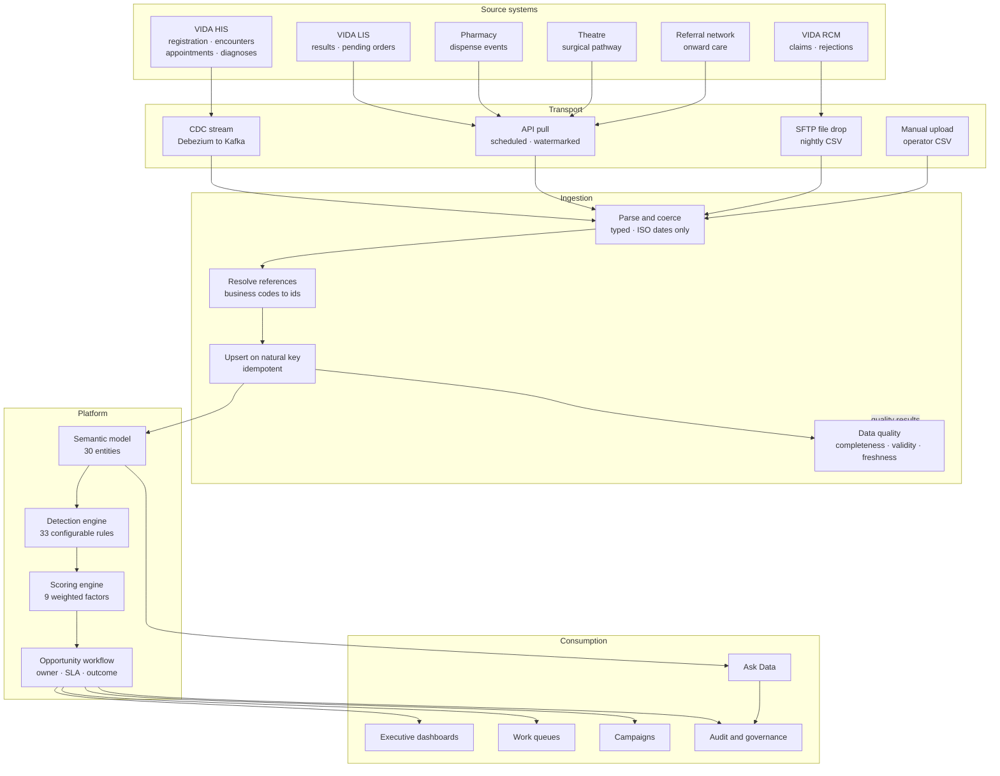

# Application Architecture

**How is this platform built, and how do I connect a system to it?**

The layers, the engines, the security model and the rules for integrating a source system. Written to be read once end to end, then returned to a section at a time.

**Written for:** Solution architects, integration engineers, platform administrators, and anyone evaluating or extending the system.

*Generated from `src/lib/docs/architecture.ts` by `npm run docs:generate`. Do not edit by hand — edit the source and regenerate, or the application and this file will disagree.*

## Contents

1. [What this system is](#purpose)
2. [The opportunity: the central object](#opportunity)
3. [The layers](#layers)
4. [The path of a single request](#request-path)
5. [Detection engine](#detection)
6. [Scoring engine](#scoring)
7. [Security and governance architecture](#security)
8. [Ask Data: natural language over the clinical model](#ask-data)
9. [Data lineage](#lineage)
10. [Integration guidelines: principles](#integration-principles)
11. [Integration guidelines: the data path](#integration-architecture)
12. [Integration guidelines: the feed contracts](#integration-feeds)
13. [Integration guidelines: choosing a transport](#integration-transport)
14. [Integration guidelines: how a load behaves](#integration-loading)
15. [Integration guidelines: data quality gates](#integration-quality)
16. [Integration guidelines: adding a feed](#integration-new-feed)
17. [Extending the platform](#extending)
18. [Taking it to production](#production)
19. [Known limits](#limits)

---

<a id="purpose"></a>

## What this system is

*And, more usefully, what it deliberately is not.*

Opportuna is an **operational opportunity management system**, not a business intelligence dashboard. The distinction drives every architectural decision that follows, so it is worth stating precisely.

A BI tool ends at the insight. It shows a director that surgical conversion fell eleven percent and leaves the question of what to do about it to a meeting. This platform is built to carry a finding all the way to an outcome, through a chain that is explicit in the data model:

```
DATA → INSIGHT → OPPORTUNITY → PRIORITY → ACTION → OUTCOME
```

Each arrow is a component. **Data** arrives through the ingestion control plane. **Insight** is produced by the detection engine, which reads the clinical and financial record and finds situations that warrant attention. Those become **opportunities** — the central object of the entire system. The scoring engine assigns each a **priority**. A named owner takes an **action**, which is recorded. The **outcome** is reconciled back against the source data, which is what makes conversion measurable rather than asserted.

> [!IMPORTANT]
> **The design test every screen has to pass**
>
> Every element on every page must help answer *what should I do next?* A chart that is merely interesting does not earn its place. This is why the product has comparatively few visualisations for its size: the default presentation is a ranked, filterable, actionable list, and a chart appears only where a shape genuinely reveals something a list cannot.

---

<a id="opportunity"></a>

## The opportunity: the central object

*One record type that everything else in the system orbits.*

If you understand one thing about this architecture, make it this. An opportunity is not a row in a report. It is a durable, owned, auditable unit of work with a lifecycle, and it is required to answer ten questions. Every field on the record exists to answer one of them.

| Question | Answered by | Where it comes from |
|---|---|---|
| **Who?** | Patient, hospital, department, physician | Ingested reference data, resolved at load time |
| **What?** | Category and rule that fired | One of 8 categories, 33 rules |
| **Why?** | Detection evidence and rule explanation | Captured by the detector at the moment it fires |
| **When?** | Detected date, due date, SLA clock | Derived from the underlying clinical event date |
| **Where?** | Hospital and department | Carried from the source record, never inferred |
| **How important?** | Priority band and numeric score | Scoring engine, with a per-factor breakdown |
| **How much value?** | Potential value in SAR | Service pricing and payer recovery rates |
| **What should we do?** | Recommended action and channel | Rule-supplied, editable by the owner |
| **Who owns it?** | Assignee and assignment history | Manual or rule-based assignment |
| **What happened?** | Status, action log, outcome, realised value | Workflow, reconciled against later source data |

> [!NOTE]
> The tenth question is the one that separates this from a reporting tool. Because outcomes are written back against the originating opportunity, the platform can tell you not just what it found but whether finding it made any difference — per rule, per category, per owner and per hospital.

---

<a id="layers"></a>

## The layers

*Seven layers, each with one responsibility and an explicit prohibition.*

The prohibition column matters more than the responsibility column. Most architectural decay in systems like this comes from a layer quietly acquiring a second job — a detector that queries the database, a page that reimplements a permission check — so each boundary is stated as something the layer must not do.

| Layer | Owns | Must not |
|---|---|---|
| **Source systems** | Clinical and financial truth. The systems of record. | Be written to by this platform. Integration is strictly read-only. |
| **Ingestion control plane** | Feed contracts, validation, reference resolution, idempotent upsert, 16 quality checks. | Interpret clinical meaning. It decides whether a row is *well-formed*, never whether it is *interesting*. |
| **Conceptual model** | The normalised entities the rest of the platform reads. Prisma schema. | Carry source-system quirks. Vendor specifics are resolved during load. |
| **Detection engine** | 33 rules across 8 families, producing candidate opportunities. | Touch the database, or decide priority. Detectors are pure functions over a preloaded snapshot. |
| **Scoring engine** | 9 weighted factors producing a score, a band and an explanation. | Be hard-coded. Weights and thresholds are administrator configuration. |
| **Workflow** | Ownership, status transitions, actions, SLA clocks, outcome reconciliation. | Move an opportunity forward without recording who did it and when. |
| **Presentation** | The question each page answers, and the shortest path to acting on it. | Make an access decision. Pages call the guard; they never filter for security themselves. |

Across those layers sit **29 navigation modules**, each gated by a permission and each opening with the operational question it exists to answer.

---

<a id="request-path"></a>

## The path of a single request

*What actually happens between a click and a rendered page.*

Every authenticated page in the application follows the same five steps. There are no exceptions, which is what makes the security properties reviewable rather than hopeful.

1. **Resolve the principal** — `getPrincipal()` reads the session cookie, loads the user, and expands their role into a flat permission list plus the set of hospital IDs they may read. This is the single place identity enters the system, and it is the seam an SSO integration replaces.
2. **Guard the route** — `guard(permission)` redirects to `/forbidden` naming the missing permission, rather than rendering a partial page. A stripped-down page invites the reader to wonder what is missing; an explicit refusal is more honest and easier for an administrator to resolve.
3. **Query within scope** — Every read helper takes the principal and applies `hospitalFilter()` to its `where` clause. Group-scope users get no restriction; everyone else gets an explicit `in` list — including, deliberately, the empty list. A user with no scope sees nothing rather than everything.
4. **Project the patient** — `projectPatient()` is the only place patient identity is turned into something renderable. Without `patient.view.phi` the caller receives a masked stub: initials, an age band, a masked contact. There is no second code path that could forget.
5. **Render and record** — The page renders as a React server component. Access to patient-level data writes a `PHI_ACCESS` audit event as a side effect of the read, not as something the page author has to remember.

> [!IMPORTANT]
> Three enforcement points, all in `src/lib/rbac.ts`: permission checks, hospital scope, PHI minimisation. If a change to this system needs a fourth, that is a signal the design has gone wrong, not that the file needs another function.

---

<a id="detection"></a>

## Detection engine

*33 rules that turn clinical and financial records into candidate opportunities.*

A detection run loads a snapshot of the relevant data once, then evaluates every enabled rule against it in memory. Detectors receive a `DetectionContext` and return candidates; they cannot reach the database. This is not a performance trick — though it is dramatically faster than per-rule querying — it is what makes rules testable in isolation and makes a run reproducible.

**Rules are configuration, not code**

Every threshold a rule uses — days overdue, minimum value, lapse windows, required prior results — is declared in `defaultParams` with human-readable `paramDocs`, and is editable by an administrator through **Opportunity Rules**. Changing when a rule fires does not require a deployment, and every change is audited as a `RULE_CHANGE` event.

**Dedupe keys make runs idempotent**

Each candidate carries a key derived from the source record identity and the rule. Running detection twice over unchanged data produces no duplicates — the second run reconciles to *updated* rather than *created*.

**Reconciliation has three outcomes**

**Created** for a genuinely new finding. **Updated** where the situation persists but its facts have changed. **Suppressed** where the underlying problem has resolved — the patient came in, the claim was paid — which closes the opportunity rather than leaving stale work in someone's queue.

**Rules hand off to each other**

Rule families overlap in reality, so the catalogue defines explicit handoffs: a medication refill stops being *overdue* and becomes *abandoned* at ninety days; lab monitoring hands over to reactivation past five hundred and forty. A patient must never appear in two queues for one problem, because two owners chasing the same person is worse than none.

> [!WARNING]
> **Tuning matters more than rule count**
>
> The first full run of this catalogue had a single rule producing fifty-three percent of the entire pipeline. It was not broken — it was correctly firing on a condition that was simply too common to be actionable. Rule count is a vanity metric; the real measure is whether the distribution across families is such that a human queue is workable. Re-examine the distribution after any rule change.

---

<a id="scoring"></a>

## Scoring engine

*Configurable weights, an explained result, and a safety floor that cannot be configured away.*

Detection decides *whether* something is an opportunity. Scoring decides *how urgently* it should be worked, by combining 9 normalised factors under administrator-configured weights. The defaults ship as follows and are editable under **Administration**.

| Factor | Default weight | Why it is weighted that way |
|---|---|---|
| **Clinical urgency** | 30 | The heaviest factor by design. Patient safety outranks revenue when the two compete. |
| **Conversion probability** | 15 | A queue of unwinnable work destroys trust in the queue itself. |
| **Financial value** | 20 | Material, but deliberately below urgency and winnability combined. |
| **Time sensitivity** | 15 | Closing windows — referral expiry, timely filing — are worth acting on now or not at all. |
| **Patient engagement** | 8 | A reachable, responsive patient converts; an unreachable one consumes the same effort for nothing. |
| **Historical utilisation** | 5 | Past attendance is the most honest available predictor of future attendance. |
| **Service availability** | 3 | No point prioritising a service with a six-week wait over one with capacity tomorrow. |
| **Insurance status** | 2 | Affects recoverability, but coverage should never be the reason a clinical case is deprioritised. |
| **Patient proximity** | 2 | A small nudge. Distance predicts attendance weakly, and weighting it heavily would encode a bias against rural patients. |

Weights are normalised, so they do not have to sum to a hundred. A score lands in a priority band at the configured thresholds — **Critical** at 78, **High** at 62, **Medium** at 42 — and the bands themselves are configuration, stored on the scoring model.

**Financial value is logarithmic**

Normalised against a ceiling defined in `src/lib/scoring.ts`. The difference between a 500 and a 5,000 opportunity should matter far more than the difference between 60,000 and 65,000. On a linear scale a handful of large surgical cases flatten every other signal to near zero, and the queue becomes a list of expensive things rather than urgent ones.

**Time sensitivity is not monotonic**

Urgency rises as something becomes overdue, peaks, then decays to a floor. A lab follow-up four days late is a live opportunity; one four years late is a different conversation and should not outrank the four-day case purely by virtue of having been ignored longer.

**Clinical safety is a floor, never a ceiling**

A rule may declare a minimum priority. It can raise a band but never lower one, and when it applies the result records `priorityOverride` explicitly so the detail page can say *why* this outranks its numeric score. A critical lab result does not wait behind a lucrative elective case because arithmetic said so.

> [!IMPORTANT]
> **Explainability is a contract, not a feature**
>
> Every score carries a per-factor contribution breakdown, rendered on the opportunity detail page. No priority is ever presented as an unexplained decision. If a user cannot see why something is ranked where it is, they will either follow it blindly or ignore it entirely — and both are worse than no ranking at all.

---

<a id="security"></a>

## Security and governance architecture

*Healthcare data, so the access model is part of the architecture rather than a layer on top.*

| Control | How it is implemented |
|---|---|
| **Authentication** | Server-side sessions. `scrypt` password hashing from the Node standard library, so there is no native dependency to compile or keep patched. Session cookie `opportuna_session`, HTTP-only, 12-hour TTL. |
| **Role-based access** | 11 roles expanding to 31 discrete permissions. Roles are catalogue entries, not strings compared at call sites. |
| **Hospital segregation** | Applied in the query layer via `hospitalFilter()`, which fails closed. A scope mistake yields an empty result, never another hospital's patients. |
| **Minimum necessary** | PHI is masked by default. `patient.view.phi` is granted to operational roles that need to contact patients, and withheld from analytical and executive roles that do not. |
| **Audit logging** | 11 event categories including PHI access, natural-language queries, SQL execution, rule and scoring changes, exports and administration. |
| **Navigation integrity** | The sidebar is derived from the principal. A link the user cannot open is never rendered — showing one teaches them nothing except that the product is inconsistent. |

> [!IMPORTANT]
> **The clinical decision boundary**
>
> The platform does not make clinical decisions and is not built to. Clinical opportunities surface a situation, the evidence behind it, and a recommended next step for a qualified professional to accept, modify or reject. The recommendation is always attributable to a named, inspectable rule — never to an opaque model — and rejecting one is a first-class recorded action, not a workaround.

That boundary is enforced by the shape of the system rather than by policy alone: there is no code path by which the platform initiates contact with a patient, alters a clinical record, or writes to any source system.

---

<a id="ask-data"></a>

## Ask Data: natural language over the clinical model

*A provider seam, and an allowlist the provider cannot argue with.*

Ask Data translates a plain-language question into SQL, runs it within the asker's scope, and returns a result with the generated SQL available to authorised technical users. The translation step sits behind a `NlSqlProvider` interface, so swapping the bundled template matcher for a hosted model is a one-file change with no effect on anything downstream.

> [!IMPORTANT]
> **Validation is allowlist-first**
>
> Generated SQL is validated before execution against an explicit table allowlist, never a blocklist of dangerous patterns. Anything not named is refused. 6 tables — including User, Session, Role and the audit trail itself — are unreachable by construction, so no prompt can talk the system into reading its own security records.

- Single statement only. Comments and statement separators are rejected outright, closing the classic comment-smuggling route.
- Write keywords are matched on word boundaries, so a column legitimately named `updated_at` is not mistaken for an `UPDATE`.
- Every query is capped at 500 rows; an explicit lower limit in the query is respected.
- Hospital scope is applied to the executed query, not to the rendered result — the answer a user sees never contains rows they could not have read directly.
- Both the natural-language question and the executed SQL are recorded as `NL_QUERY` and `SQL_EXECUTION` audit events, which is what makes an AI feature reviewable after the fact.

---

<a id="lineage"></a>

## Data lineage

*Connecting the source applications to every screen, not just the integration section.*

A chart renders identically whether the feed behind it is current or three days dead. That is the most dangerous failure mode a platform like this has, and it is why lineage is a first-class layer rather than integration documentation. 20 routes carry a provenance entry naming the feeds they depend on and stating what the page would get wrong if those feeds stalled.

- The **provenance bar** renders above every page, naming the source applications behind it. Collapsed by default; it asserts itself only when a feed *that page* depends on is in trouble.
- It is rendered once in the app layout, not per page, so feed status is fetched once per request and a new page inherits its lineage automatically.
- The **Lineage Map** reads the relationship both ways: application to pages, for the integrator about to take a connector down; page to source, for the director who thinks a figure looks wrong.
- Route-to-feed mapping lives in `src/lib/lineage.ts`. Adding a page means adding one entry there and nothing else.

- [Lineage Map](/integration/lineage) — The live two-way matrix
- [Integration Overview](/integration) — Architecture and current feed health

---

<a id="integration-principles"></a>

## Integration guidelines: principles

*Six rules that hold for every source system, regardless of transport.*

Everything from here to the end of the document is the integration contract. Read this section before designing a connector; the sections that follow are reference material you will return to during build.

**1. The platform is strictly read-only**

No connector writes back to a source system, ever. When an outcome needs to reach the HIS — an appointment booked, a claim resubmitted — a person does it in that system, and the platform reconciles the result on the next load. This is a deliberate constraint: it means a defect here can never corrupt a clinical record.

**2. The source system remains the system of record**

Where the platform and the HIS disagree, the HIS is right. The platform holds a derived working copy whose purpose is to support prioritisation, not to become a second version of the truth that people start reconciling against.

**3. Every load is idempotent**

Loads are upserts on a declared natural key, never blind inserts. Replaying yesterday's file must be a no-op, because it will happen — during a backfill, after a failed run, when a scheduler double-fires. A connector that cannot safely replay is not finished.

**4. The contract is the code**

Feed definitions live in `src/lib/ingestion/domains.ts`, and the field-mapping screen, CSV templates, validator and loader all read from there. There is no separate specification document to fall out of date, because the documented interface and the running one are the same object.

**5. Dates are ISO 8601, always**

Coercion is strict and locale-free. `01/02/2026` is rejected rather than guessed at, because guessing wrong by a month is invisible in aggregate and corrupts every overdue calculation downstream. Send `2026-02-01`, or `2026-02-01T09:30:00Z` where time matters.

**6. No PHI in transport metadata**

Patient identifiers belong in the payload, never in a filename, URL path or query string. Those are logged by intermediaries you do not control — load balancers, proxies, CDN edges — and a log is exactly where PHI must not be.

---

<a id="integration-architecture"></a>

## Integration guidelines: the data path

*Five tiers, and where a connector fits into them.*



The tiers exist because the question an integrator actually asks is "where does this field come from and what reads it", and a tiered flow answers that by tracing downwards. Transport is a property of the source system, not a platform choice — the platform accommodates whatever a system can offer.

| Tier | What it is | How it typically fails |
|---|---|---|
| **Source systems** | Systems of record. Never written to. | Schema changes announced late, or not at all. |
| **Transport** | CDC stream, API pull, file drop, manual upload. | Silent stalls. The connector reports success having moved nothing. |
| **Ingestion** | Parse, validate, resolve references, upsert, evaluate quality. | Valid rows that are semantically useless — present, well-formed, and wrong. |
| **Platform** | Conceptual model, detection, scoring, workflow. | A missing feed removes a whole category with no error anywhere. |
| **Consumption** | 29 modules, exports, Ask Data. | A figure that is confidently wrong because an upstream feed stopped. |

---

<a id="integration-feeds"></a>

## Integration guidelines: the feed contracts

*9 feeds, 134 fields, 71 of them required.*

Each feed maps to one target entity and is keyed by a natural key drawn from the source system's own identifiers. The natural key is what makes replay safe, so getting it right is the single most consequential decision in a new connector.

| Feed | Target entity | Natural key | Fields | Required |
|---|---|---|---|---|
| **Patient registration** | `Patient` | `mrn` | 27 | 9 |
| **Clinical encounters** | `Encounter` | `sourceId` | 16 | 8 |
| **Laboratory results** | `LabResult` | `sourceId` | 16 | 9 |
| **Appointments** | `Appointment` | `sourceId` | 11 | 8 |
| **Insurance claims** | `InsuranceClaim` | `claimNumber` | 23 | 10 |
| **Pharmacy dispensing** | `PharmacyTransaction` | `sourceId` | 8 | 6 |
| **Surgical pathway** | `Surgery` | `sourceId` | 14 | 8 |
| **Referrals** | `Referral` | `sourceId` | 12 | 8 |
| **Diagnoses** | `Diagnosis` | `patientId + icd10 + diagnosedAt` | 7 | 5 |

*Generated from the feed contracts the loader itself reads.*

> [!NOTE]
> Download a template with the exact expected header for any feed from **Data & integration → Upload Data**. The template is generated from the same contract, so a file built from it cannot have a column-name mismatch.

---

<a id="integration-transport"></a>

## Integration guidelines: choosing a transport

*Four modes. Pick on the source system's capability, not on preference.*

| Mode | Use when | Latency | What to watch |
|---|---|---|---|
| **CDC stream** | The source has a replicable database and you need near-real-time change capture. | Seconds to minutes | Read from a replica, never the primary. Schema drift breaks the stream silently; alarm on lag, not just on errors. |
| **API pull** | The system exposes a paginated, filterable read API. The most common case. | Scheduled | Watermark on server-side modification time, not on your own clock. Handle pagination cursors expiring mid-run. |
| **File drop** | The system exports batches, or the vendor will not open an API. | Hourly to daily | Never read a file still being written — require an atomic rename or a sidecar completion marker. |
| **Manual upload** | One-off backfills, pilots, and feeds with no automated path yet. | On demand | Requires `integration.ingest`. Excluded from staleness alarms by design, since a manual feed is not expected to be current. |

> [!WARNING]
> **Watermarks, not wall clocks**
>
> Incremental pulls must watermark on the source system's own modification timestamp. Watermarking on the connector's clock loses every record written during a run, and the gap is invisible — no error, no reject, just records that never arrive. Overlap each window by a few minutes and let the idempotent upsert absorb the duplicates.

---

<a id="integration-loading"></a>

## Integration guidelines: how a load behaves

*Dry run, then commit. What passes, what is rejected, and at which granularity.*

1. **Parse** — RFC 4180 CSV. UTF-8, with or without a byte-order mark. Quoted fields may contain commas and newlines. A file whose header does not match the contract is refused whole — a missing column is a connector defect, and loading nine columns out of ten produces a silently incomplete dataset that is far more expensive to detect later.
2. **Validate** — Per row, against the field contract: required-field presence, type coercion, enum membership, strict ISO 8601 dates. Failures are collected as issues with a row number and a reason, not thrown on the first bad row — one malformed row should not hide the other four hundred.
3. **Resolve references** — Foreign keys are resolved by natural key, not by internal ID. An encounter arrives referencing an MRN; if no such patient exists the row is rejected rather than orphaned, because an orphan is a row that exists but can never be found by any rule.
4. **Dry run** — Every upload is validated and reported before anything is written. The run shows what would be created, what would be updated, and every issue. Nothing is committed until a person with `integration.ingest` says so.
5. **Commit** — Upsert on the natural key inside a run record that captures counts, issues, duration and actor. The run is the audit artefact: what arrived, when, from whom, and what the platform made of it.
6. **Evaluate quality** — Separately from loading, 16 named checks assess whether the loaded data can actually drive the rules that depend on it.

> [!IMPORTANT]
> **Loading and quality are different questions**
>
> Ingestion tells you a row loaded. Quality tells you whether it was worth loading. A patient feed with every column present and the consent flag absent is a perfect load and a broken dataset — it silently excludes every patient from every outreach rule, and nothing in the load result would ever tell you.

---

<a id="integration-quality"></a>

## Integration guidelines: data quality gates

*16 checks across five dimensions, each tied to the rule it protects.*

| Dimension | The question it asks | A failure you will actually see |
|---|---|---|
| **Completeness** | Are the fields the rules need populated? | Consent flag absent, so every outreach rule matches nobody. |
| **Validity** | Are values within their permitted domain? | An unrecognised result flag makes lab results invisible to every laboratory rule. |
| **Consistency** | Do related values agree with each other? | Paid exceeding approved — almost always transposed amount columns. |
| **Timeliness** | Is the most recent record recent? | A feed that stopped three days ago and is still reporting successful runs. |
| **Uniqueness** | Is the natural key actually unique? | A key that is not unique turns idempotent upserts into silent overwrites. |

Each check carries a severity. **Critical** means the dependent rules cannot function and the affected category will quietly under-report. **Warning** means degraded quality that is worth chasing but not worth stopping for. Checks are thresholded ratios rather than absolutes, because a real feed always contains some proportion of imperfect rows.

- [Data Quality](/integration/quality) — Current results per check
- [Ingestion Pipelines](/integration/pipelines) — Run history, counts and reject rates

---

<a id="integration-new-feed"></a>

## Integration guidelines: adding a feed

*The complete checklist. Six steps, one file each.*

1. **Define the contract** — Add a `DomainSpec` to `src/lib/ingestion/domains.ts`: target entity, natural key, and every field with its type and required flag. This one edit gives you the CSV template, the field-mapping screen, the validator and the loader — none of them need touching.
2. **Register the source and pipeline** — Create the `SourceSystem` if the feed comes from a system not yet known, then an `IngestionPipeline` binding source to feed with its transport mode and schedule.
3. **Map the fields** — Record `FieldMapping` rows from the source system's column names to the contract's. Mapping is data, so a vendor renaming a column is a configuration change rather than a release.
4. **Add quality rules** — Write a `DataQualityRule` for each field the downstream rules actually depend on, and implement the matching check in `src/lib/ingestion/quality.ts`, keyed identically. Do not skip this: it is the only thing standing between you and a feed that loads perfectly and means nothing.
5. **Declare the lineage** — Add the feed to the `LINEAGE` entries of every page it reaches in `src/lib/lineage.ts`, with an honest `impact` line saying what that page gets wrong without it. This is what makes the provenance bar tell the truth.
6. **Write the detection rule** — A feed that no rule reads is storage, not integration. Add the rule to `src/lib/detection/rules.ts` with its parameters declared and documented, implement the detector, and check the pipeline distribution afterwards.

> [!WARNING]
> **Schema change protocol**
>
> Additive changes — a new optional column — are safe and need no coordination. Removing or renaming a field, or changing its type or enum domain, is breaking: update the contract and the mappings in the same release, and run a dry run against real production-shaped data before enabling the pipeline. A source system that renames a column without notice will show up as a sudden reject-rate spike rather than as an outage, so alarm on reject rate, not only on run failure.

---

<a id="extending"></a>

## Extending the platform

*Where each kind of change belongs.*

| To add… | Edit | And nothing else, because… |
|---|---|---|
| A detection rule | `src/lib/detection/rules.ts` + `detectors.ts` | The rules screen, parameter editor and audit trail are all derived from the catalogue. |
| An ingestion feed | `src/lib/ingestion/domains.ts` | Template, mapping screen, validator and loader all read the contract. |
| A page | A route under `src/app/(app)/` + `navigation.ts` + `lineage.ts` | The shell, guard and provenance bar are inherited from the layout. |
| A role | `src/lib/rbac.ts` | Navigation and every guard are derived from the permission list. |
| A scoring factor | `src/lib/enums.ts` + `scoring.ts` | The weight editor and the explanation panel both iterate the factor list. |

---

<a id="production"></a>

## Taking it to production

*Four seams, each designed to be replaced without touching anything around it.*

**Identity → `getPrincipal()`**

Replace the session lookup with your SSO or OIDC provider, mapping directory groups onto the role catalogue. Everything downstream consumes a `Principal` and is indifferent to where it came from.

**Language model → `NlSqlProvider`**

Implement the interface against your hosted model. The validator, the scope filter, the row cap and the audit trail sit outside the provider and apply regardless of what it returns.

**Data source → `loadContext()`**

The detection snapshot loader is the seam for a warehouse. Point it at Snowflake or a read replica and the detectors are unaffected, because they never knew where the data came from.

**Database → `DATABASE_URL`**

The schema is written for portability: enum-like columns are stored as strings and validated in `src/lib/enums.ts` rather than as database enums, so the move to Postgres is a provider change and a migration.

> [!WARNING]
> **Before any real patient data touches this**
>
> Generate a fresh `AUTH_SECRET` per environment. Terminate TLS in front of the application. Move audit events to append-only storage with retention matching your regulatory obligation. Review the PHI masking rules against your own minimum-necessary policy — the shipped defaults are a reasonable starting position, not a compliance determination for your jurisdiction.

---

<a id="limits"></a>

## Known limits

*Stated plainly, because discovering these during an evaluation is worse.*

- Detection runs in batch, not continuously. An opportunity appears at the next run after its triggering event, so the effective latency is the run interval and not the feed latency.
- Potential value is modelled from service pricing and payer recovery rates. It is a prioritisation input, not a financial forecast, and should never be added up and presented as expected revenue.
- Conversion attribution is temporal, not causal. A patient who would have returned anyway still counts as a conversion; treat the rate as a directional measure of queue health rather than proof of impact.
- The bundled Ask Data provider matches templates rather than generating arbitrary SQL. It is honest about not understanding a question rather than guessing — swap in a model provider for open-ended querying.
- Hospital segregation is enforced in the query layer, not by the database. A direct database connection bypasses it, so protect database credentials accordingly.
