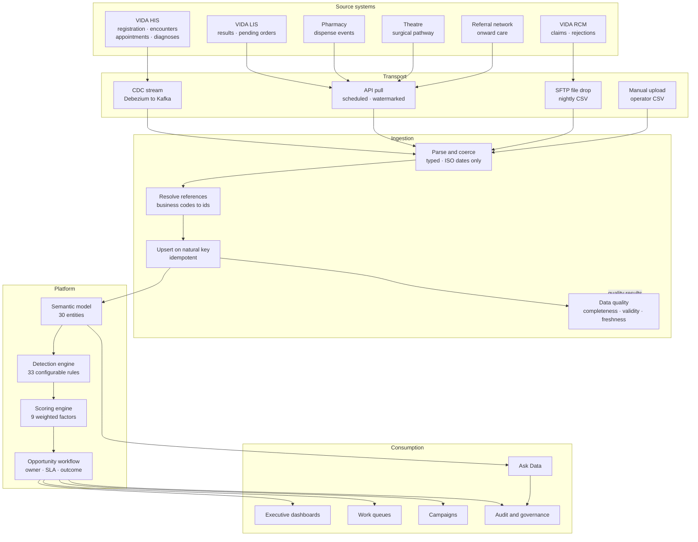

# Integration diagram

The same architecture the application renders on **Data & integration → Integration Overview**,
as Mermaid source — for pasting into a wiki, a design document or a slide.

GitHub, GitLab, Notion and Confluence all render this natively.

*Generated from `src/components/IntegrationDiagram.tsx` by `npm run docs:diagram`. Do not edit by hand.*

## Architecture

## Reading it

**Five tiers, top to bottom, following the real data path.**

| Tier | What it is | How it fails |
|---|---|---|
| **Source systems** | Systems of record. The platform never writes back to any of them. | Schema changes announced late, or not at all. |
| **Transport** | How each system delivers. A property of the source, not a platform choice. | Going silent — which looks identical to a quiet period, so staleness is measured against each pipeline's own schedule rather than a global constant. |
| **Ingestion** | Where a row is accepted or rejected. Nothing reaches the platform schema unvalidated. | Loudly. Rejected rows carry their row number, column and offending value. |
| **Platform** | The semantic model, then the engines that turn it into prioritised work. | Quietly — a rule whose input field stopped arriving simply finds nothing, and nobody notices for weeks. |
| **Consumption** | Everything that reads. All of it through the scoped access layer; nothing queries tables directly. | Access errors, which fail closed. |

**The dashed line is the feedback path.** Run status, quality results and watermarks return to the
ingestion control plane — that is what the Pipelines and Data Quality screens read.

## Feeds

| Feed | Lands in | Natural key | Fields | Required |
|---|---|---|---|---|
| **Patient registration** | `Patient` | `mrn` | 27 | 9 |
| **Clinical encounters** | `Encounter` | `sourceId` | 16 | 8 |
| **Laboratory results** | `LabResult` | `sourceId` | 16 | 9 |
| **Appointments** | `Appointment` | `sourceId` | 11 | 8 |
| **Insurance claims** | `InsuranceClaim` | `claimNumber` | 23 | 10 |
| **Pharmacy dispensing** | `PharmacyTransaction` | `sourceId` | 8 | 6 |
| **Surgical pathway** | `Surgery` | `sourceId` | 14 | 8 |
| **Referrals** | `Referral` | `sourceId` | 12 | 8 |
| **Diagnoses** | `Diagnosis` | `patientId + icd10 + diagnosedAt` | 7 | 5 |

## Where each piece lives

| Element | Code |
|---|---|
| Feed contracts | `src/lib/ingestion/domains.ts` |
| Parsing and type coercion | `src/lib/ingestion/parse.ts` |
| Reference resolution and upsert | `src/lib/ingestion/load.ts` |
| Run orchestration, pipeline health | `src/lib/ingestion/run.ts` |
| Quality checks | `src/lib/ingestion/quality.ts` |
| Semantic model | `prisma/schema.prisma`, `src/lib/enums.ts` |
| Detection engine | `src/lib/detection/` |
| Scoring engine | `src/lib/scoring.ts` |
| Scoped access layer | `src/lib/queries.ts`, `src/lib/rbac.ts` |
| Ask Data | `src/lib/nlsql/` |
| Diagram source | `src/components/IntegrationDiagram.tsx` |

## Integration seams

Three modules are isolated so a production swap touches one file each.

| Seam | Module | Replace it to |
|---|---|---|
| Identity | `getPrincipal()` in `src/lib/auth.ts` | Move from session cookies to enterprise SSO / OIDC. Everything downstream consumes the resolved `Principal`, so nothing else moves. |
| Natural language to SQL | `NlSqlProvider` in `src/lib/nlsql/types.ts` | Connect the hospital's existing engine. Validation, scope binding, execution and auditing stay on the platform side of the seam, so a new engine inherits the guardrails rather than reimplementing them. |
| Source reads | `loadContext()` in `src/lib/detection/context.ts` | Move the warehouse to Snowflake or Postgres. The 33 detection rules are untouched. |

See [DATA-PLATFORM.md](DATA-PLATFORM.md) for the full production mapping, and
[INGESTION-MANUAL.md](INGESTION-MANUAL.md) for the operating procedure.
